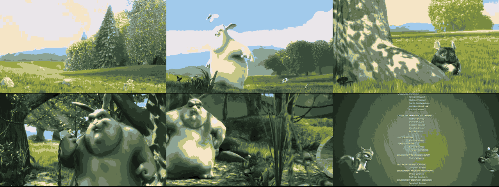
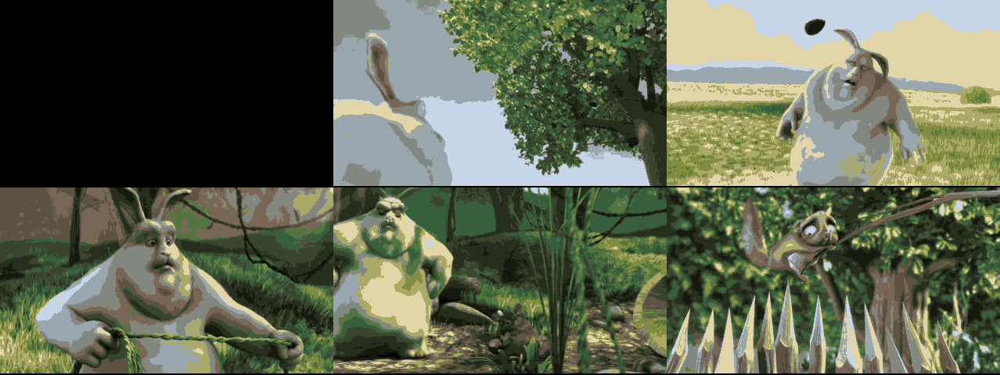

# ffmpeg-montage

A shell script that creates video montages from a single input video file. Supports two modes:
- **Grid mode**: Creates a spatial grid layout of video segments (like a contact sheet)
- **Time-based mode**: Concatenates video segments chronologically with audio

## Getting Started

Assuming you've downloaded https://download.blender.org/peach/bigbuckbunny_movies/big_buck_bunny_480p_stereo.avi (a 9:56 Creative Commons animated short), here are some examples to get you started:

```bash
# Create a 3x2 contact sheet sampling different scenes (2-second clips)
./ffmpeg-montage -o "0:10,1:30,4:20,6:00,7:45,9:00" -d "2" -g "3x2" big_buck_bunny_480p_stereo.avi bunny_grid.mp4

# Make a 9-second highlight reel with audio (3-second clips)
./ffmpeg-montage -o "1:30,4:15,7:20" -d "3" big_buck_bunny_480p_stereo.avi bunny_highlights.mp4

# Preview the ffmpeg command without executing
./ffmpeg-montage -o "1:00,3:00,5:00" -d "2" -g "1x3" --print big_buck_bunny_480p_stereo.avi test.mp4
```

## Requirements

- ffmpeg with ffprobe
- Standard POSIX shell

## Usage

```bash
ffmpeg-montage -o offsets -d duration [-g WxH] [--print] input.mp4 output.mp4
```

### Options

- `-o, --offset`: Comma-separated list of start times (required)
- `-d, --duration`: Duration(s) for each segment (required)
- `-g, --grid`: Grid dimensions (WxH) for spatial layout (optional)
- `--print`: Print the ffmpeg command instead of executing it

### Time Format

Times can be specified as:
- Seconds: `30`
- Minutes:seconds: `1:30`
- Hours:minutes:seconds: `1:30:45`

## Grid Mode Examples

Grid mode creates a spatial layout where multiple video segments are displayed simultaneously in a grid pattern.

### Basic 2x2 Grid

Extract 4 segments of 2 seconds each and arrange them in a 2x2 grid:

```bash
./ffmpeg-montage -o "0:10,1:00,2:30,4:00" -d "5" -g "2x2" big_buck_bunny_480p_h264.mov test_grid.mp4
```

This creates a 2-column, 2-row layout sampling throughout the video.

**Preview:** 
**Download:** [img/grid_2x2.mp4](img/grid_2x2.mp4)

<details>
<summary>Show generated ffmpeg command</summary>

```bash
ffmpeg -i "big_buck_bunny_480p_h264.mov" -filter_complex "[0:v]trim=start=10:duration=5,setpts=PTS-STARTPTS,scale=426:240,pad=426:240:(ow-iw)/2:(oh-ih)/2:color=black[v1]; [0:v]trim=start=60:duration=5,setpts=PTS-STARTPTS,scale=426:240,pad=426:240:(ow-iw)/2:(oh-ih)/2:color=black[v2]; [0:v]trim=start=150:duration=5,setpts=PTS-STARTPTS,scale=426:240,pad=426:240:(ow-iw)/2:(oh-ih)/2:color=black[v3]; [0:v]trim=start=240:duration=5,setpts=PTS-STARTPTS,scale=426:240,pad=426:240:(ow-iw)/2:(oh-ih)/2:color=black[v4]; [v1] [v2] [v3] [v4]xstack=inputs=4:layout=0_0|426_0|0_240|426_240[outv]" -map "[outv]" -c:v libx264 -crf 18 -preset fast "test_grid.mp4"
```
</details>

### 3x2 Grid

Extract 6 segments and arrange them in a 3x2 grid:

```bash
./ffmpeg-montage -o "0:10,1:20,2:30,4:10,6:00,8:30" -d "3" -g "3x2" big_buck_bunny_480p_h264.mov img/grid_3x2.mp4
```

**Preview:** 
**Download:** [img/grid_3x2.mp4](img/grid_3x2.mp4)

<details>
<summary>Show generated ffmpeg command</summary>

```bash
ffmpeg -i "big_buck_bunny_480p_h264.mov" -filter_complex "[0:v]trim=start=10:duration=3,setpts=PTS-STARTPTS,scale=284:240,pad=284:240:color=black[v1]; [0:v]trim=start=80:duration=3,setpts=PTS-STARTPTS,scale=284:240,pad=284:240:color=black[v2]; [0:v]trim=start=150:duration=3,setpts=PTS-STARTPTS,scale=284:240,pad=284:240:color=black[v3]; [0:v]trim=start=250:duration=3,setpts=PTS-STARTPTS,scale=284:240,pad=284:240:color=black[v4]; [0:v]trim=start=360:duration=3,setpts=PTS-STARTPTS,scale=284:240,pad=284:240:color=black[v5]; [0:v]trim=start=510:duration=3,setpts=PTS-STARTPTS,scale=284:240,pad=284:240:color=black[v6]; [v1] [v2] [v3] [v4] [v5] [v6]xstack=inputs=6:layout=0_0|284_0|568_0|0_240|284_240|568_240[outv]" -map "[outv]" -c:v libx264 -crf 18 -preset fast "img/grid_3x2.mp4"
```
</details>

### Creating a Contact Sheet

Sample every minute and a half throughout the 9:56 video:

```bash
./ffmpeg-montage -o "0,1:30,3:00,4:30,6:00,7:30" -d "2" -g "3x2" big_buck_bunny_480p_h264.mov img/contact_sheet.mp4
```

**Preview:** 
**Download:** [img/contact_sheet.mp4](img/contact_sheet.mp4)

### Preview Just the Command

See what ffmpeg command will be generated without executing:

```bash
./ffmpeg-montage -o "0:30,3:00,6:30" -d "5" -g "1x3" --print big_buck_bunny_480p_h264.mov preview.mp4
```

## Time-based Mode Examples

Time-based mode concatenates segments chronologically, preserving audio.

> **Note:** The Big Buck Bunny file has an odd width (853px) which causes issues with time-based mode in some ffmpeg versions. For demonstration, here's the command structure:

### Basic Concatenation

Extract and join three 10-second clips from Big Buck Bunny:

```bash
./ffmpeg-montage -o "1:30,4:15,7:20" -d "10" big_buck_bunny_480p_h264.mov highlights.mp4
```

Creates: `[1:30-1:40] → [4:15-4:25] → [7:20-7:30]`

**Preview:** 
**Download:** [img/highlights.mp4](img/highlights.mp4)

<details>
<summary>Show generated ffmpeg command</summary>

```bash
ffmpeg -i "big_buck_bunny_480p_h264.mov" -filter_complex "[0:v]trim=start=90:duration=10,setpts=PTS-STARTPTS[v1]; [0:a]atrim=start=90:duration=10,asetpts=PTS-STARTPTS[a1]; [0:v]trim=start=255:duration=10,setpts=PTS-STARTPTS[v2]; [0:a]atrim=start=255:duration=10,asetpts=PTS-STARTPTS[a2]; [0:v]trim=start=440:duration=10,setpts=PTS-STARTPTS[v3]; [0:a]atrim=start=440:duration=10,asetpts=PTS-STARTPTS[a3]; [v1][a1][v2][a2][v3][a3]concat=n=3:v=1:a=1[outv][outa]" -map "[outv]" -map "[outa]" -c:v libx264 -c:a aac -crf 18 -preset fast "highlights.mp4"
```
</details>

### Variable Duration Segments

Different duration for each segment:

```bash
./ffmpeg-montage -o "0:30,2:15,5:45" -d "5,8,12" big_buck_bunny_480p_h264.mov variable_cuts.mp4
```

Creates: `[0:30-0:35] → [2:15-2:23] → [5:45-5:57]`

**Preview:** 
**Download:** [img/variable_cuts.mp4](img/variable_cuts.mp4)

### Quick Trailer

Create a 30-second trailer from key moments in the short film:

```bash
./ffmpeg-montage -o "0:15,2:30,5:10,7:45" -d "6,8,7,9" big_buck_bunny_480p_h264.mov bunny_trailer.mp4
```

## Practical Use Cases

### Content Review
```bash
# Create a contact sheet for quick content review of Big Buck Bunny
./ffmpeg-montage -o "0,1:00,2:00,3:00,4:00,5:00" -d "3" -g "3x2" big_buck_bunny_480p_h264.mov img/review.mp4
```

### Character Introduction Montage
```bash
# Sample key character moments every 90 seconds
./ffmpeg-montage -o "0:15,1:45,3:15,4:45,6:15,7:45" -d "4" -g "3x2" big_buck_bunny_480p_h264.mov img/character_grid.mp4
```

### A/B Testing Cuts
```bash
# Compare different timing for the same scene
./ffmpeg-montage -o "2:23,2:25,2:27" -d "10" -g "1x3" big_buck_bunny_480p_h264.mov img/timing_test.mp4
```

### Working with Your Own Videos

For videos with even-width dimensions, time-based mode works perfectly:

```bash
# Highlight reel with audio (for properly dimensioned videos)
./ffmpeg-montage -o "1:15,3:30,6:45" -d "8,6,10" your_video.mp4 highlights.mp4

# Commercial removal
./ffmpeg-montage -o "0,5:30,11:45,18:20" -d "5:25,6:10,6:30,4:15" tv_show.mp4 no_ads.mp4
```

## Tips

1. **Grid vs Time-based**: Use `-g` for visual comparison, omit for sequential playback
2. **Testing**: Use `--print` to preview commands before processing large files
3. **Performance**: Shorter durations and smaller grids process faster
4. **Quality**: The script uses CRF 18 for high quality output
5. **Audio**: Grid mode discards audio; time-based mode preserves it

## Common Errors

- **"More segments than grid cells"**: Your grid is too small for the number of segments
- **"Number of durations does not match"**: In time-based mode, provide either one duration (applied to all) or one per segment
- **"Must provide --duration"**: The `-d` parameter is always required

## Output Quality

The script uses these ffmpeg settings:
- Video codec: libx264
- CRF: 18 (high quality)
- Preset: fast (good speed/quality balance)
- Audio codec: aac (time-based mode only)

## Converting to GIF

The example GIFs shown above were created using high compression settings for smaller file sizes. Here's how to convert the MP4 outputs to optimized GIFs:

### Two-Pass Method (Best Quality)

```bash
# Step 1: Generate optimized palette
ffmpeg -i your_video.mp4 -vf "fps=10,scale=-1:-1:flags=lanczos,palettegen=max_colors=16" -y palette.png

# Step 2: Create GIF using the palette
ffmpeg -i your_video.mp4 -i palette.png -lavfi "fps=10,scale=-1:-1:flags=lanczos[x];[x][1:v]paletteuse=dither=bayer:bayer_scale=5" -y output.gif
```

### Batch Convert All Examples

```bash
cd img
for mp4 in *.mp4; do
    # Generate palette
    ffmpeg -i "$mp4" -vf "fps=10,scale=-1:-1:flags=lanczos,palettegen=max_colors=16" -y "${mp4%.mp4}_palette.png"
    # Create GIF
    ffmpeg -i "$mp4" -i "${mp4%.mp4}_palette.png" -lavfi "fps=10,scale=-1:-1:flags=lanczos[x];[x][1:v]paletteuse=dither=bayer:bayer_scale=5" -y "${mp4%.mp4}.gif"
    # Clean up palette
    rm "${mp4%.mp4}_palette.png"
done
```

### GIF Optimization Settings

- **`fps=10`**: Reduces from 24fps to 10fps for smaller files
- **`max_colors=16`**: Limits palette to 16 colors for high compression
- **`dither=bayer:bayer_scale=5`**: Adds dithering to improve quality with limited colors
- **`flags=lanczos`**: High-quality scaling algorithm
